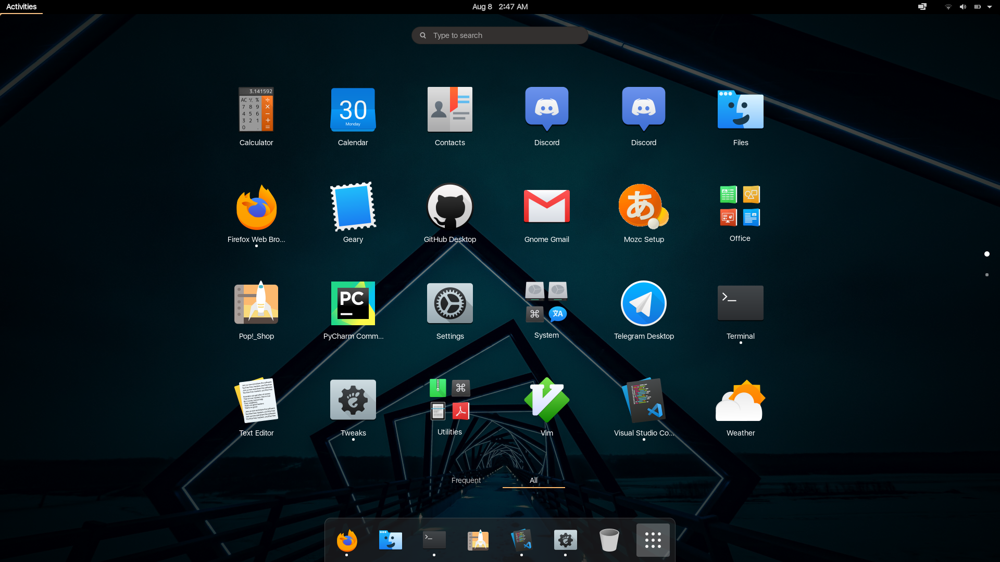

# gnome-mac-theme
one script to make your gnome DE look just like a macOS.

### pre-requirement:
#### * [git](https://git-scm.com/)
##### if you dont have git:
`
$ sudo apt install -y git
`

## how to run:

`
$ git clone https://github.com/itaysmalia/gnome-mac-theme.git
`
`
$ cd gnome-mac-theme
`
`
$ chmod u+x ./main.bash
`
`
$ ./main.bash
`

### And that is all!!
##### let me know if there were any error:
##### itays.malia@gmail.com
##### thank you for using the gnome mac theme script.
##### feel free to leave a star ;)
